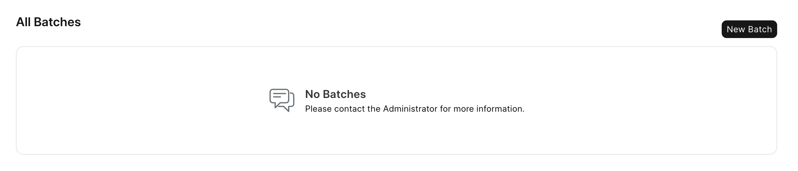
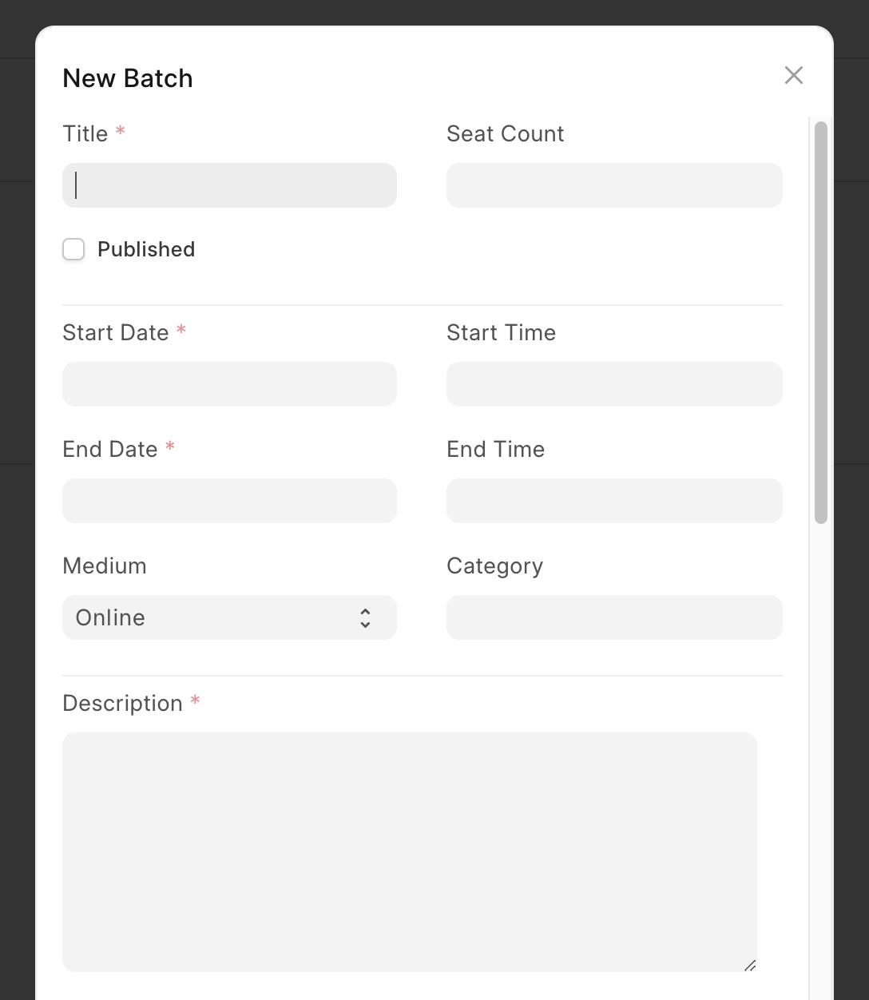
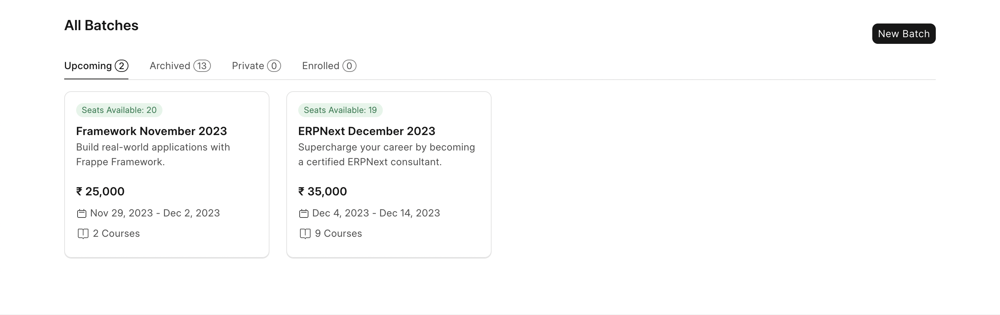
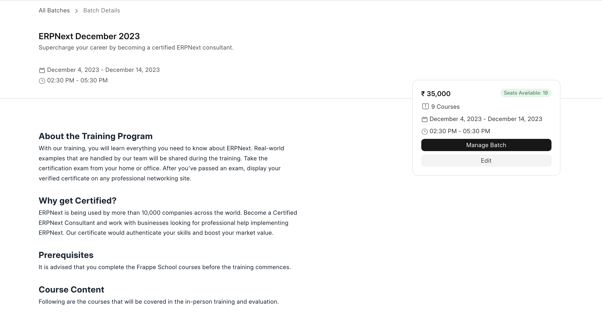
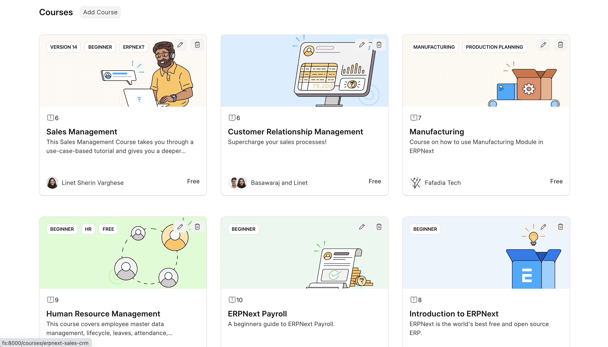

# Create a Class

A batch is a group of students enrolled for the same set of courses at the same time. Only Moderators can create batches on LMS.

To create a new batch click on the **New Batch** button. Enter the following batch details in the dialog.

- **Title:** Give the batch an appropriate title.
- **Seat Count:** Seat Count means the maximum number of students that will be allowed for this batch. Once the batch has this number of students, no more students will be accepted. These restrictions are applied when user tries to enroll for the batch after payment and also when a moderator manually enrolls students.
- **Start Date:** The date on which the batch begins.
- **End Date:** The date on which the batch ends.
- **Medium:** The medium of instruction for the batch. It can be either Online or Offline.
- **Category:** The category of the batch. You can add categories using the LMS Category doctype. These can then be used to categorize batches.
- **Description:** A short description of the batch. This information appears on the batch details page.
- **Batch Details:** A detailed description of the batch. This can include the syllabus, prerequisites, etc. This appears on the batch details page.
- **Batch Details Raw:** This is the raw HTML version of the batch details. You can use this to add any custom HTML to the batch details page.
- **Meta Image:** This is the image that will appear when you share the batch's link on any social media platform.
- **Paid Batch:** If its a paid batch, you can enable this. If the batch is paid, then the students will have to pay the batch fee before they can enroll for the batch.
- **Amount:** The amount that students will have to pay for the batch if it's a paid batch.
- **Currency:** The currency in which students will have to pay for the batch if it's a paid batch.

After entering all these details, save the form. You will be redirected to the batch details page.

On the batch details page, you see all the batch information you had just entered. You can now add courses to the batch from this page. At the bottom there is a section of courses. You can add courses from here.

Click on the Manage Batch button to enter more details.

In the batch details are various tabs like Courses, Students, Assessments, Discussions, Live Class, etc.

From the **Students** tab, you can add students manually. All you have to do is enter the email id of the student. The student must be a user of the LMS else you won't be able to add them to the class.

To add assessments click on the assessment tab. Assessments in Frappe LMS are of two types, Quizzes and Assignments. You can add both of them from the assessment tab.

Once the courses and students are added to the batch you can click on the student's name to check their progress. The progress page will list all the quizzes and assignments of the batch. It will also show the score and status that a student has received for the activity. The progress page also lists the evaluation attempts of the student. It shows if a student has passed the evaluation or not.

## Students Dashboard

On this batch page a student also sees their dashboard. The dashboard shows the student's progress in the batch. Students can also schedule evaluations from the dashboard. The dashboard also shows the upcoming scheduled evaluations of the student.

