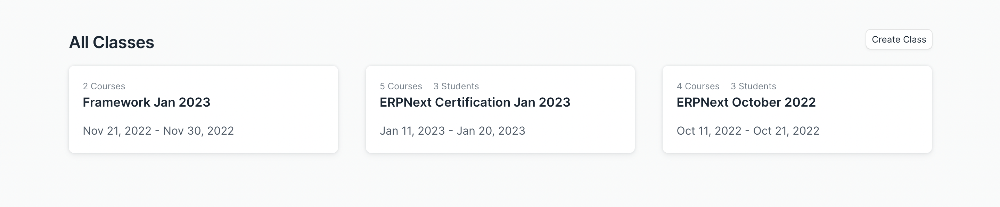

# Create a Class

A class is a group of students enrolled for the same set of courses at the same time. Only Moderators can create classes on LMS.

To create a new class click on the **Create Class** button. Enter the following class details.

- **Title:** Give the class an appropriate title.
- **Start Date:** Select the beginning date.
- **End Date:** Select the end date.
- **Description:** Provide a brief description.

After entering all these details, save the form. Your class will be available in the class list. Click on the class to check out the details.

From the class details page, you can add courses and students. From the **Courses** tab, select the courses you want.

From the **Students** tab, you can add students. All you have to do is enter the Email ID of the student. The student must be a user of the LMS else you won't be able to add them to the class.

Once the courses and students are added to the class you can click on the student's name to check their progress. The progress page will list all the quizzes and assignments that belong to each course of the class. It will also show the score and status that a student has received for the activity. The progress page also lists the evaluation attempts of the student. It shows if a student has passed the evaluation or not.

