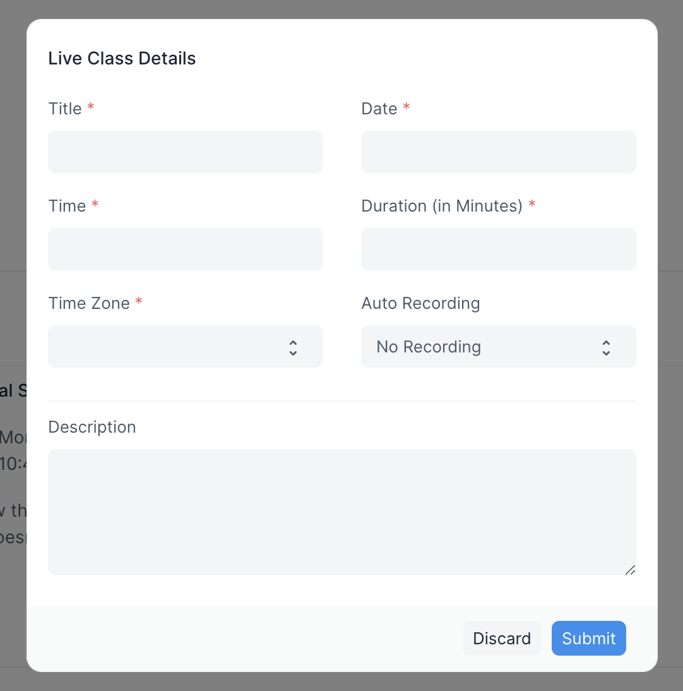

# Live Class

Moderators on LMS can host a live session from the class page. The live class will be through Zoom. Once a live class is created all students of the class will receive a calendar invite. All upcoming live classes will be listed on the class page. Students can join the current session from the class page itself. 

## Setup

To use this feature, you must create a Server to Server OAuth App from the Zoom App Marketplace. You can follow [this document](https://marketplace.zoom.us/docs/guides/build/server-to-server-oauth-app/) for the same.

Creating a Server to Server OAuth App provides you with an Account ID, Client ID, and Client Secret. You will have to enter these 3 values in the Zoom Settings Doctype.

To send a calendar invite for a live class, you will also need to enable google settings and add the google calendar of the moderator/instructor. To enable Google Settings, follow the steps mentioned in [this document](https://docs.erpnext.com/docs/v12/user/manual/en/erpnext_integration/google_settings).

Once all this has been set up, you can create a live class. A live class can only be created if a class has students. To create a live class, visit the class page. Click on the button **Create a Live Class**. Fill in the details in the dialog.

For Auto Recording to work ensure that Automatic Recording is enabled on your Zoom Account.

Once the details are submitted, the live class gets saved in your Zoom Account as well as the LMS backend. A calendar invite also gets sent to all the students of the class.

