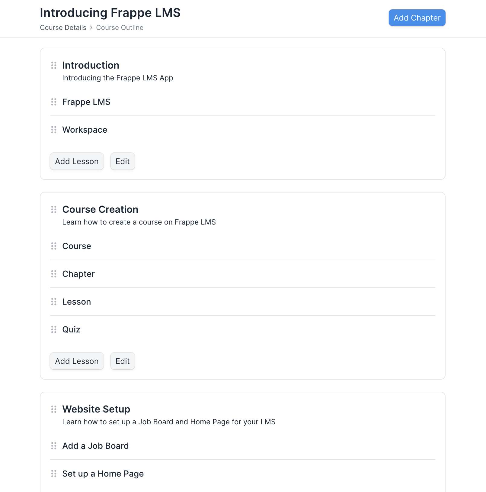

# Chapter

A chapter forms the second layer in the LMS hierarchy. It is used to group lessons that belong to the same topic.

You can add chapters from the Course Outline page. To add a chapter, click on the Add Chapter button. In the dialog, enter the following information.

 - **Chapter Name:** Add a title to your chapter.
 - **Short Description:** Provide a one-line description for your chapter.

After entering these details, you can save the chapter.

