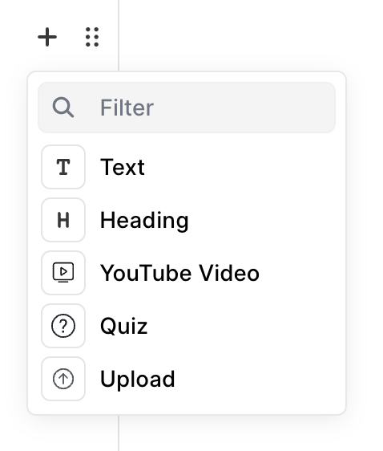

# Lesson

When you create a chapter, you will see a button **Add Lesson** below the chapter. To create a new lesson, click on this button. It will take you to the Lesson Details page.

To create a lesson, a user will have to enter the following details on the lesson page:

 - **Title:** Add a clear title for the lesson.
 - **Show preview of this lesson to Guest users:** If you want Guest users to be able to see this lesson without enrolling for the course, just to get a preview, you can enable this option.
 - **Instructor Notes:** If there is some content that you want to share only with the instructors and moderators of the LMS, and don't want students to see it, you can add such content here. These notes will only be visible to users who have Course Creator, Course Evaluator and Moderator role. Any sort of teaching or training instructions can be shared here.
 - **Content:** In the content editor you can add various components to your lesson. When you hover on the editor, a plus icon will appear at the left of it. Click on the icon to open the lesson menu. From the menu, you can select the type of content you want to add.

## Type of content you can add in lesson

1. Text - You can enter any text content
2. Heading - To add headings in your lesson
3. YouTube Video - Embed YouTube videos in your lesson by pasting the ID of the video. The ID is part of the URL after watch?v=. For example, if the URL is https://www.youtube.com/watch?v=QH2-TGUlwu4, the ID is QH2-TGUlwu4.
4. Quiz - You can add quizzes that you have created to the lessons
5. Upload - You can upload images, videos, pdf's and audio files to the lesson.

## Embed components.
You can embed the following components to the lesson.

1. Google Slides - If you have a presentation on google slides you can add it to your lesson. Slides provides an option called Publish on Web. Clicking on this gives you a link. Copy this link upto the pub parameter. Paste it on your lesson and the google slides gets rendered.
2. Vimeo Video - Copy the url of the vimeo video and paste it in the lesson editor. The video will be rendered.

