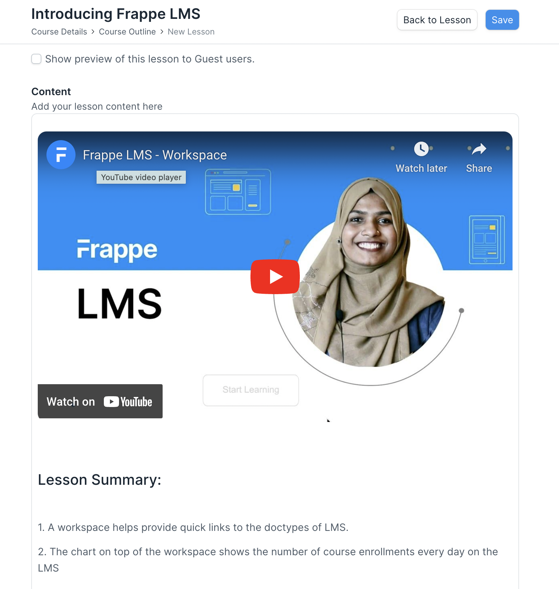

# Lesson

When you create a chapter, you will see a button **Add Lesson** below the chapter. To create a new lesson, click on this button. It will take you to the Lesson Details page.

To create a lesson, a user will have to enter the following details on the lesson page:

 - **Title:** Add a clear title for the lesson.
 - **Show preview of this lesson to Guest users:** If you want Guest users to be able to see this lesson without enrolling for the course, just to get a preview, you can enable this option.
 - **Content:** In the content editor you can add various components to your lesson. When you hover on the editor, a plus icon will appear at the left of it. Click on the icon to open the components menu. From the menu, you can select the type of content you want to add. You can add text content directly. If you select YouTube Video from the menu, you will have to enter the YouTube video ID in the menu. For a quiz, you can just select it from the list of quizzes created by you. You can add all other components similarly.

 ::: tip YouTube Video ID 
 The ID is part of the URL after watch?v=. For example, if the URL is https://www.youtube.com/watch?v=QH2-TGUlwu4, the ID is QH2-TGUlwu4
 :::
