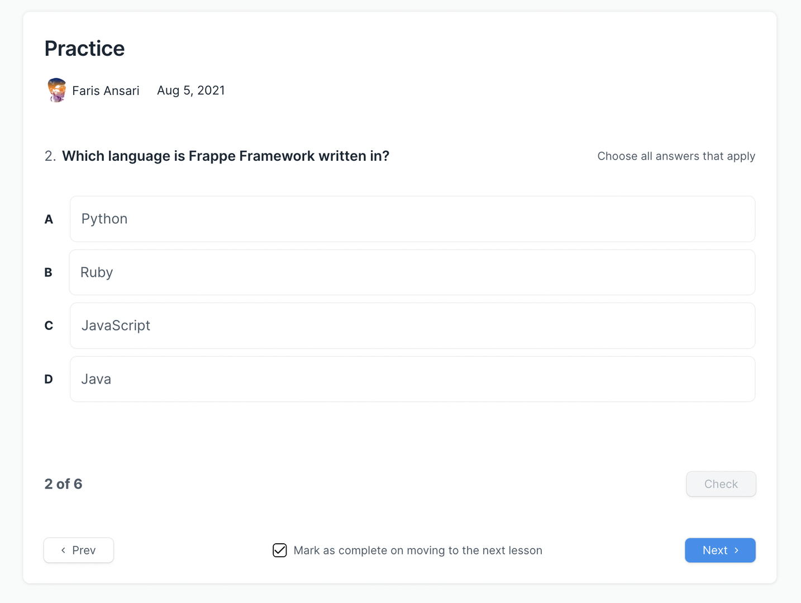
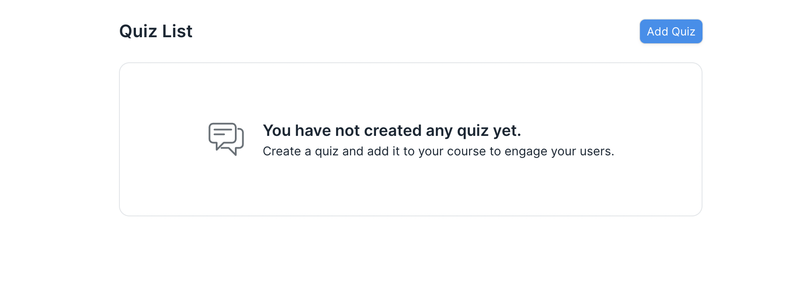
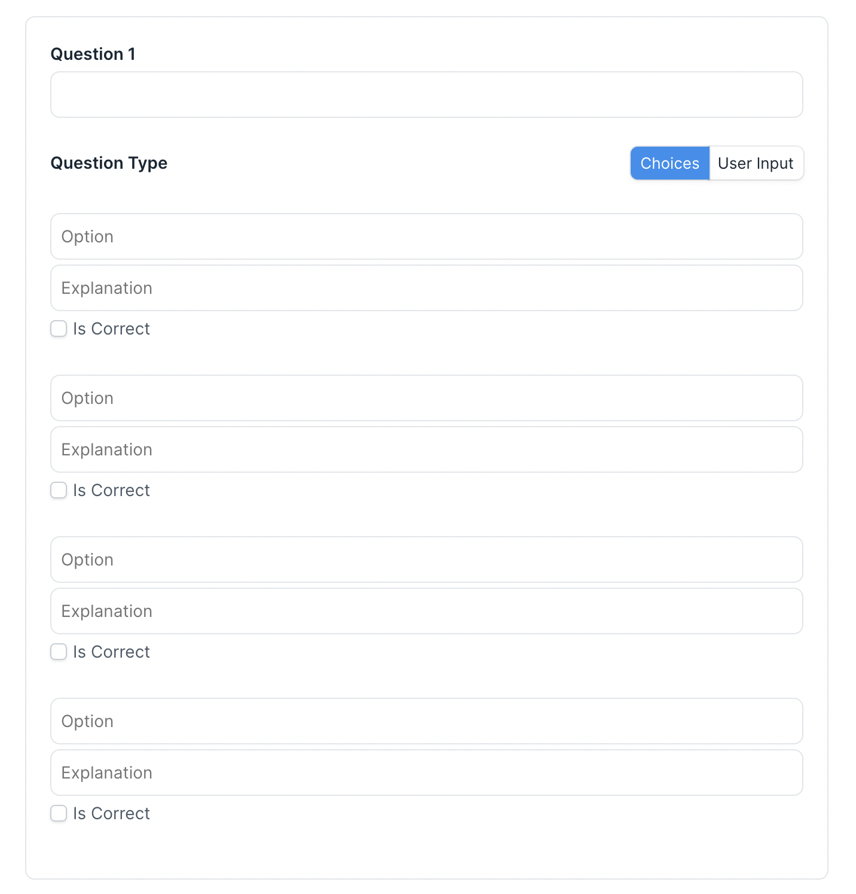
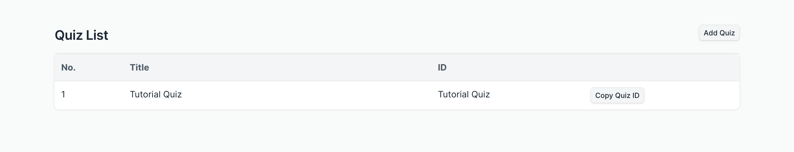

# Quiz

Quiz help make lessons interactive and ensures a quick revision of concepts learned previously.

To create a quiz, click on the **Create Quiz** button from the lesson page. You will be redirected to the Quiz List. The list will be empty if you have not created any quizzes yet. Click on **Add Quiz** to create a new quiz. You will be redirected to the quiz form.

Enter the following information in the quiz form:

 - **Quiz Title:** Give your quiz a relevant title.
 - **Question:** Enter the question in this field.
 - **Type:** Select the type of question. There are 2 types. For multiple choice questions select the type as **Choices**. For questions where you expect your users to type an answer select the type as **User Input**.

**Choices:**
If your question type is Choices, then enter information in the following fields:
 - **Options:** Provide options for the question in this field. A question should have a minimum of 2 options and a maximum of 4 options.
 - **Explanation:** You can explain why an option is correct or incorrect using this field.
 - **Is Correct:** If an option is correct you can check this field to indicate the same. A question can have more than one correct option.

**User Input:**
If your question type is User Input, then enter information in the following fields:
 - **Possible Answer:** Enter the possible answer for the question in this field. You can add a minimum of 1 and a maximum of 4 possible answers. When the user inputs an answer to this question, their answer will be compared against all possible answers that you have entered. If the user's answer matches any of the possible answers, then the user's answer will be considered correct.

::: tip Add more questions
To add more questions click on the **New Question** button.
:::

Once you have entered all the information you can save the quiz. You will notice an entry for the quiz in the quiz list. You can copy the quiz id from the list using the **Copy Quiz ID** button. Then you can paste it in the lessons Quiz ID field where you want the quiz.

