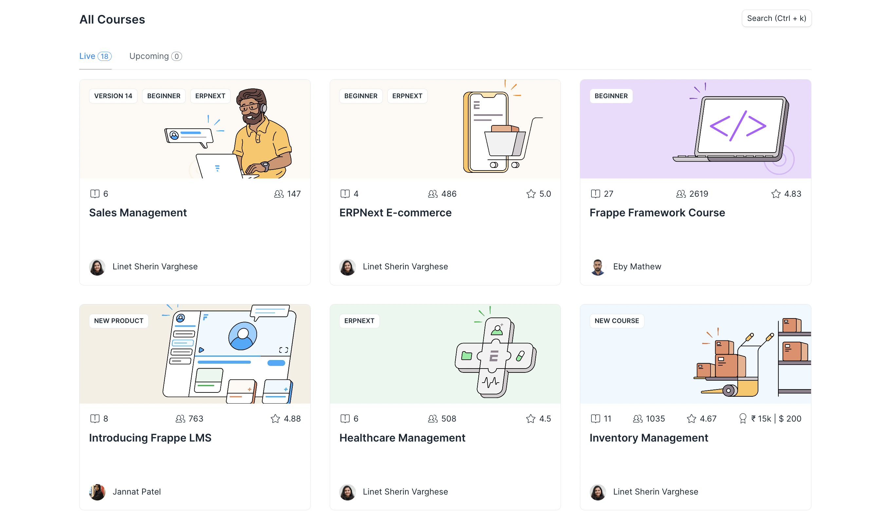

# Introduction

Frappe LMS is an easy-to-use, open-source Learning Management System. It helps you set up your own learning platform.

## What can you do with Frappe LMS

📚 Create and share online courses with your target audience.

📝 Create interesting and interactive lessons in the form of text, videos, quizzes, etc.

💬 Solve queries of your students using the discussion section.

🏛 Group your students into classes to track their progress better

💻 Conduct live classes by integrating your zoom account with the LMS

📈 Keep a watch on important numbers like signup and enrolment count using the Statistics Dashboard

💼 Help your students find career opportunities using the Job Board.

## Who can use Frappe LMS

🚀 Organisations wanting to train their employees internally

🚀 Company’s wanting to train their users about their products

🚀 Schools and Universities who wish to have their study material available online for their students.

🚀 Entrepreneurs/Freelancers/Influencers who want to share their knowledge and experience with others out there.

## Platforms using Frappe LMS

 - [Frappe School](https://frappe.school/courses)
 - [Mon School](https://mon.school/courses)
 - [Tinkerhub](https://tinkerhub.frappe.cloud/courses)

 ## Get Started

 - [Setup your account](./get-started/setup-your-account.md)
 - [Create a Course](./course-creation/create-a-course.md)
 - [Add a Chapter](./course-creation/add-a-chapter.md)
 - [Add a Lesson](./course-creation/add-a-lesson.md)