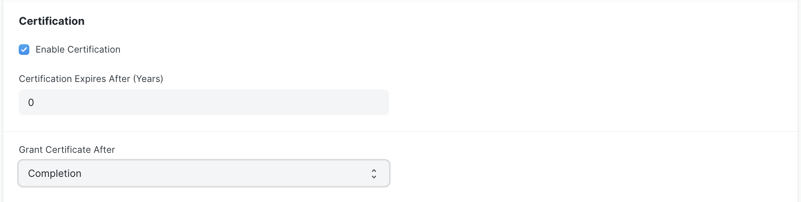

# Frequently Asked Questions

## How to add YouTube Video in a lesson or for course preview.

If you have a video that provides a teaser or preview of the course, you can add it to your course. To add a preview video, follow the steps mentioned below:

 - Upload the video on youtube.
 - Once uploaded, click on the share icon that appears below the video. You will see an option called embed.
 - On clicking it, it provides an iframe. Copy the source (src) of the iframe and paste it in the **Preview Video Link** field of the course form or **YouTube Video ID** field of lesson form.

## How to issue a certificate to students after course completion.

To grant users certificate for a course once they have completed it, follow these steps:

 - Go to the **LMS Course** doctype.
 - Open the course you want to enable certification for.
 - In the **Certification** section, click on **Enable Certification**.
 - You can set an expiry for the certificate in years. Its an optional field. 0 means the certificate will never expire.
 - Set the value of **Grant Certificate After** as **Completion**
 - Save

 Once this configuration is done, users will be able to get a certificate once they complete a course.

## How to setup Razorpay Account on LMS

Make sure you have a Razorpay account created for accepting payments. If you don't you can create one from [here](https://razorpay.com/)

Once you have your Razorpay account ready, you can proceed to the LMS Settings doctype to add these details there.

In the LMS Settings doctype open the tab called Payment Settings. Here add details like your Razorpay Key, Razorpay Secret. Then save the settings. You can now start receivig payment on LMS.