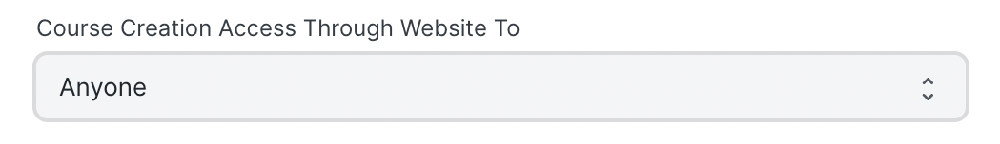
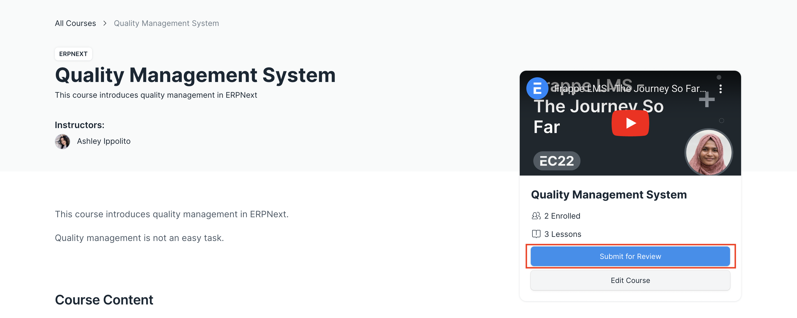
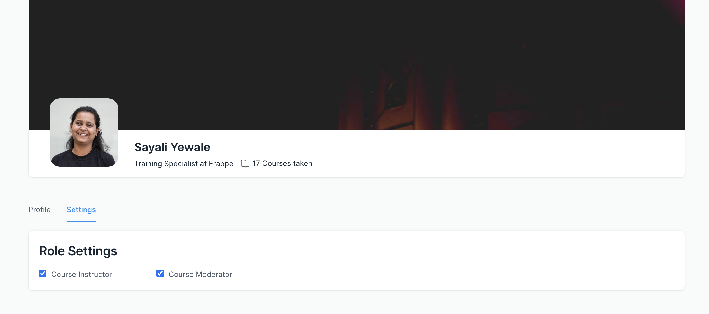

# Who can create a course

Before we get into who can create a course let us understand 2 important roles in LMS:

 - [Course Instructor](/roles/who-can-create-a-course.html#course-instructor)
 - [Course Moderator](/roles/who-can-create-a-course.html#course-moderator)

## Course Instructor

Users with this role can create a course. They can't publish a course though. They can edit only the courses they have created.

## Course Moderator

Users with this role can edit courses created by anyone. They can review courses created by others and publish them if they find it good.

## Course Flow

In LMS, you can allow anyone, or only users with the Course Instructor role to create a course. The Admin can configure this through the LMS Settings doctype.

Once users are given the right to create courses, they will see the **Create a Course** button on the dashboard.

They can create courses through the portal, but they won't be able to publish the course. They can only submit the course for review.

Once a course is submitted for review, a Course Moderator can review it through the dashboard under the **Under Review** tab. They can edit any course and make changes to it. They can ask the Course Instructor to make changes. Once they find the course good enough, they can publish the course. They can also mark the course as upcoming and also unpublish a course.

Course Moderators can also manage the roles of other users from their profiles. They can visit their profile page and modify the roles.

